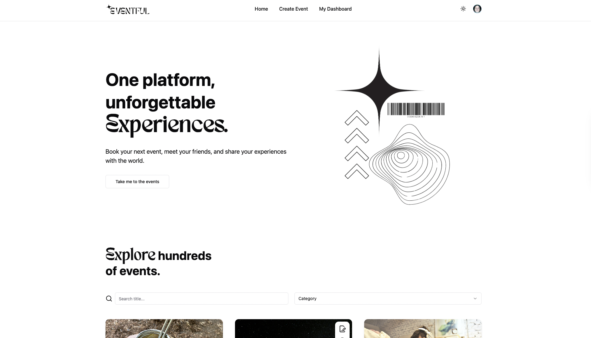

# Eventful - Event Booking App

Fully type-safe Event Management application called “Eventful” developed using React, TypeScript, and Next.js. The app is designed to handle the booking of small and medium-sized events, focusing on speed, efficiency, and user-friendliness. Eventful features a fully responsive design optimized for mobile devices.

## Authors

- [@StefanAiroaie](https://github.com/StefanAiroaie)
- [@renehellmich](https://github.com/renehellmich)
- [@cr-eative-dev](https://github.com/cr-eative-dev)

## Demo

https://eventful-jade.vercel.app/

## Screenshots

## Tech Stack

**Client:** React, NextJS, Typescript, TailwindCSS, UploadThing, Shadcn, Lucide

**Server:** MongoDB, Mongoose, Stripe, Clerk
